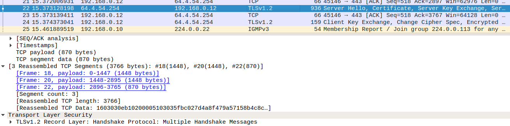

# Simulador de Protocolo de Transferência orientado a conexão

---
**Nomes: Gabriel Fanto Stundner, Luiz Guerra, Ramon Fernandes**

**Data: 23/11/2020**

---

## Pegando o Arquivo texto do Computador

O Arquivo <code style="color: blue"> fileManager.py</code> lida com o arquivo texto requisitado pelo usuário, onde com ele podemos selecionar o Arquivo do computador, onde tem a seguinte descrição do código:

Foi utilizado o **tkinter** para criar uma visualização gráfica para o usuário selecionar o seu arquivo.

A construção da tela de diálogo com o usuário foi construido da seguinte forma:

```python
from tkinter import *
from tkinter import filedialog

# Criando uma Tela Inicial
window = Tk()

# Definindo o título da tela
window.title("Gerenciador de Arquivos")

# Definindo tamanho da tela
window.geometry("800x500")

# Definindo a cor de fundo da tela
window.config(background = "white")

# Label interno da tela
label_file = Label(window,text = "Abrindo Arquivo para envio",width = 100, height = 4,fg = "green")

# Botão de encontrar o Arquivo
button_explore = Button(window,text = "Encontrar Arquivo",command = browseFile)

# Botão de fechar
button_exit = Button(window,text = "Sair",command = exit)

# Colocar as informações na tela
label_file.grid(column = 1, row = 1)
button_explore.grid(column = 1, row = 2)
button_exit.grid(column = 1, row = 3)

# Esperando uma resposta
window.mainloop()
```

Essa página do Tkinter irá ficar da seguinte forma:


Quando o usuário clicar no botão **Encontrar Arquivo** ele vai poder selecionar o Arquivo desejado dentro dos diretórios internos do programa


Assim que for iniciado o processo de procurar o arquivo internamente dentro do computador, ele vai iniciar um Método onde vai pegar o caminho para o arquivo selecionado e o copiar para um Arquivo interno do Projeto chamado **file.txt** como mostrado o código abaixo:

```python
from tkinter import filedialog
from shutil import copyfile

# Tela do File Manager
def browseFile():
    filename = filedialog.askopenfilename(initialdir = "/",title = "Selecione um Arquivo",filetypes=[("Tipo de Arquivo","*.txt")])
    # Alterar o conteudo
    label_file.configure(text = "Arquivo Aberto: " + filename)
    copyfile(filename,"./file.txt")
```

Só vão ser pegos arquivos .txt do sistema, definido assim para evitar de criar situações complexas com arquivos de video ou audio.

Para iniciarmos o programa do fileManager, devemos primeiro possuir o python3 instalado no computador e baixar o tkinter para python3:

```shell
> sudo apt-get install python3-tk
```

Depois de instalado, rodamos o programa do fileManager:

```shell
> python3 fileManager.py
```

---

## Iniciando o Servidor UDP

Nosso Servidor UDP está configurado no Arquivo  <code style="color: blue"> udpserver.py</code>, onde ele deve ser iniciado em um Terminal Específico para ele.

Foi utilizado Sockets para construir o Servidor, onde no python precisamos somente chamar a biblioteca _socket_ do python.

```python
import socket
```

Foram construídas as Seguintes variáveis para serem usada em nosso Servidor:

```python
serverIP = "127.0.0.1" #IP do servidor, sendo Localhost
localPort = 8184 #Porta definida para o Servidor
bufferSize = 300 #Tamanho de bytes sendo enviados
msgFromServer = "Mensagem Encaminhada" #String que o Cliente deve receber
bytesToSend = str.encode(msgFromServer) #Tamanho de bytes da mensagem
```

Como estamos trabalhando com Sockets UDP, devemos construir um Datagram Socket para enviar controlar o envio

```python
# Criando um Datagram Socket
UDPServerSocket = socket.socket(family=socket.AF_INET, type=socket.SOCK_DGRAM)
```

Devemos então fazer um _bind_ (definir o IP e Porta do Servidor)

```python
UDPServerSocket.bind((serverIP,localPort))
```

Vai ter que possuir uma mensagem para o nosso Terminal para vermos se o Servidor foi inicializado

```python
print("UDP Server UP and LISTENING!")
```

Agora temos uma estrutura onde vai ficar esperando uma resposta do cliente, onde vamos tratar com erros que podem ocorrer no Servidor, de forma geral:

```python
# Esperando por qualquer Datagram para o Servidor
try:
   # ...
except Exception as e:
    print("\n========================")
    print("Server exception ocurred")
    print(e)
    print("========================")
finally:
    UDPServerSocket.close()
    print("\n========================")
    print("     Server closed")
    print("========================")
```

Dentro do **try** iremos construir uma estrutura **While** que vai permanentemente esperar uma resposta de usuário, onde ele vai ir tratando essa resposta

```python
 while(True):
        # Recebendo mensagem do Cliente
        bytesAddressPair = UDPServerSocket.recvfrom(bufferSize)
        message = bytesAddressPair[0].decode('utf-16')
        address = bytesAddressPair[1]

        # Apresentação da Mensagem
        print("Mensagem do Cliente: {}".format(message))
        print("Porta do Cliente: {}".format(address))
        print("\n\n")
        sleep(1)

        # Guardando os dados em um novo arquivo
        f = open("fileCopied.txt","a")
        f.write(message)
        f.close()

        # Enviando resposta ao Cliente
        UDPServerSocket.sendto(bytesToSend,address)
```

* Então seguindo os passos que ele vai fazer:
  * Primeiro ele vai receber a mensagem e vai guardar em uma lista, onde a **mensagem é a primeira posição** e o endereço do usuário é a segunda, onde esse **endereço é a Porta do Cliente**.
  * Apresenta no terminal esses dados, depois de apresentar o sistema vai dar 1 segundo de _sleep_ antes de receber a proxima parte.
  * Depois de mostrar qual é a mensagem, ele vai guardar essa String em um novo Arquivo texto, chamado **fileCopied.txt**.

Para iniciarmos o Servidor, devemos em um Terminal possuir o **python3**, onde com ele iremos rodar o nosso Servidor:

```shell
> python3 udpserver.py
```

Deixe esse Terminal com o Servidor rodando.

---

## Iniciando o Client

O nosso Arquivo para rodar o Cliente se chama <code style="color: blue"> udpclient.py</code> onde é com ele que iremos ler o arquivo **file.txt** e enviar para o Servidor.

Estamos usando a biblioteca do Socket também para o cliente, onde temos as seguintes variáveis:

```python
# Pegar o Arquivo texto no tipo utf-8
file = open("file.txt", "r", encoding='utf-8', errors="strict")

# Ler o arquivo e salvar em utf-16 em uma variável
encodedStr = file.read().encode("utf-16", errors="replace")

# Tupla com os dados para enviar ao Servidor
serverAddressPort = ("127.0.0.1", 8184)

# Número de bytes para enviar para o Servidor
bufferSize = 300

# Divisão do texto em pacotes de 300 bytes
packages = [encodedStr[i:i+bufferSize] for i in range (0, len(encodedStr), bufferSize)]
```

Agora criamos um Socket Datagram como é no Servidor

```python
# Criando Socket UDP do cliente
UDPClientSocket = socket.socket(family=socket.AF_INET, type=socket.SOCK_DGRAM)
```

E agora iremos enviar os pacotes para o Servidor, utilizando um For para podermos gerenciar quais pacotes foram enviados para o Servidor e cada vez que é enviado um pacote, o Servidor vai responder para o cliente se foi recebido.

```python
i = 0
for package in packages:
    UDPClientSocket.sendto(package,serverAddressPort)
    # Pegando mensagem do Servidor
    msgFromServer = UDPClientSocket.recvfrom(bufferSize)
    print("Enviando pacote {}".format(i))
    print("Mensagem do Servidor: {}".format(msgFromServer[0]))
    i = i + 1
```

Dessa forma temos como ver se o pacote foi enviado e se o Servidor recebeu esse pacote.

---

## Verificando no Wireshark

Podemos ver os envios TCP pelo Wireshark, onde são divididos em fragmentos cada vez que ele envia, onde as partes do envio aparecem assim no Wireshark:


Dai quando o Servidor responde para o cliente ele junta os fragmentos na resposta, como mostra a imagem abaixo:



Quando o Cliente envia uma mensagem, é feito um Client Hello, onde possui um Header com um tamanho específico, que no teste específico possui 32 bytes


---

## Repositório Original

O Link para o Repositório Original onde esse projeto foi trabalhado é **https://github.com/F4NT0/Socket_Network_Transfer**